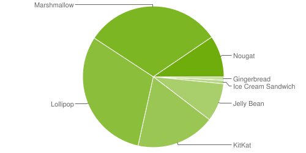

# Android Device Fragmentation and the Developer

Unlike iOS, Android has a serious device fragmentation issue. This precipitates itself in a number of different ways.

 * Multiple platform versions "in the wild" with a significant percentage of unsupported devices
 * Devices can't be updated to current versions
 * Device vendors do not support current software versions even for current hardware

TODO: This should become a tech note.

Things to discuss:

 * Device adoption levels
 * The Kitkat v4.4 issue (TSL security), fixed in V4.4.4
 * 
 * [Google Mobile Services](https://www.android.com/intl/en_uk/gms/) (GMS) is a collection of Google applications and APIs that help support functionality across devices

A representative list of Android devices can be found on the [Xamarin Test Cloud](https://testcloud.xamarin.com/devices), select the Android 

# Platform Versions

Data taken from [Device uptake](https://developer.android.com/about/dashboards/index.html) (updated fortnightly) & correct at 2017-06-05

Version	| Codename |	API	| Distribution | Supported | Release Date
------- | -------- | ------ | ------------ | --------- | ------------
2.3.3..7 | Gingerbread	| 10	| 0.8%     | No | 2010
4.0.3..4 | Ice Cream Sandwich |	15 |	0.8%  | No | 2011
4.1.x	 | Jelly Bean      |	16|	3.1% | No | 2012
4.2.x	 | -"-           |	17|	4.4%  | No | 2012
4.3      | -"-	         | 18	| 1.3%  | No | 2012  
4.4      | KitKat	     | 19	| 18.1% | 4.4.4 *only* | 2013
5.0      | Lollipop      | 	21	| 8.2% | Yes | 2014
5.1	     | -"-           | 22	| 22.6% | Yes | 2014
6.0	     | Marshmallow   |	23	| 31.2% | Yes | 2015
7.0	     | Nougat	     | 24	| 8.9% | Yes | 2016
7.1	     | -"-           | 25	| 0.6% | Yes | 2016
8.0      | O             | 26   | - | Beta | -

NOTE: Platform versions prior to 4.4.4 (The final ".4" is important) are *not* supported by Google (Approximatly 10% of the userbase)

## Fragmentation Chart

## Historic Distribution (Via Wikipedia)

# Example devices and OS versions

Device                              | Version | API
----------------------------------- | ------- | ---
Panasonic Toughbook FZ-A1           |  4.0    | 15 *Unsupported*
Samsung Galaxy Tab A6 / SM-T280     |  5.1.1  | 22
Samsung Galaxy XCover 4 / SM-G390F  |  7.0    | 24