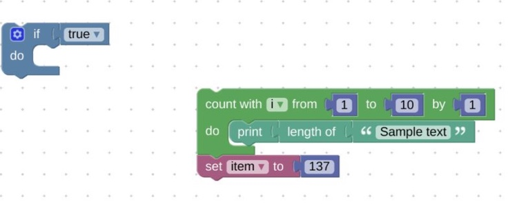

# Blockly's XML Structure

- [x] @mentions, #refs, [links](), **formatting**, and <del>tags</del> supported
- [x] list syntax required (any unordered or ordered list supported)
- [x] this is a complete item
- [ ] this is an incomplete item

## TODO:

 * Shadow Blocks
 * Variables

## Examples

Note: Blocks are described using [JSON](./json.md) and loaded separately. XML is only used for storing user's code and only includes the values that the user can modify (including the locations of blocks in the workspace).
More info on the JSON format can be found [here](https://developers.google.com/blockly/custom-blocks/json-definition?hl=en).

### Sample blocks in workspace:



### Corresponding XML:

```xml
<xml xmlns="http://www.w3.org/1999/xhtml">
  <block type="controls_if" x="38" y="62">
   <value name="IF0">
      <block type="logic_boolean">
            <field name="BOOL">TRUE</field>
      </block>
    </value>
  </block>
  <block type="controls_for" x="263" y="138">
        <field name="VAR">i</field>
        <value name="FROM">
              <block type="math_number">
                    <field name="NUM">1</field>
              </block>
        </value>
        <value name="TO">
              <block type="math_number">
                    <field name="NUM">10</field>
              </block>
        </value>
        <value name="BY">
              <block type="math_number">
                    <field name="NUM">1</field>
              </block>
        </value>
        <statement name="DO">
              <block type="text_print">
                    <value name="TEXT">
                          <block type="text_length">
                                <value name="VALUE">
                                      <block type="text">
                                            <field name="TEXT">Sample text</field>
                                      </block>
                                </value>
                          </block>
                    </value>
              </block>
        </statement>
        <next>
              <block type="variables_set">
                    <field name="VAR">item</field>
                    <value name="VALUE">
                          <block type="math_number">
                                <field name="NUM">137</field>
                          </block>
                    </value>
                </block>
          </next>
  </block>
</xml>
```

## Tags

In general, unknown tags or attributes (such as the legacy `id` attribute on blocks) are silently ignored and do not need to be included in the serialized output of any newer version of Blockly XML. The top-level tag is an xml tag with namespace "http://www.w3.org/1999/xhtml".

```xml
<xml xmlns="http://www.w3.org/1999/xhtml">
  ...
</xml>
```

### Block
All tags directly nested in the top-level xml tag are blocks. These are called top-level blocks (TLB), in contrast to blocks that exist on the inputs and connections of a top-level block. There are two top-level blocks in this example.

```xml
<xml xmlns="http://www.w3.org/1999/xhtml">
  <block type="controls_if" x="38" y="62">
  ...
  </block>
  <block type="controls_for" x="263" y="138">   ...
  </block>
</xml>
```

#### Block Attributes

##### `type`

All blocks have an attribute named `type`. This gives the name of the prototype block to load from the BlockFactory and populate according to the XML. This is variously called `name`, `id`, and `type` in code and documentation.

##### `x` & `y`
All top-level blocks have `x` and `y` attributes. These denote the location of the block in the workspace. Non-TLBs calculate their locations depending on the blocks that they are connected to, and do not have `x` and `y` attributes.

##### `deletable`

The boolean `deletable` attribute specifies whether a block can be deleted by the users.

##### `movable`

The boolean `movable` attribute is used to fix a block in a specfied location.


Tags that can be found inside a `<block/>` tag are: `value` , `field`, `next`, and `statement`.

### Field

```xml
<block type="logic_boolean">
 <field name="BOOL">TRUE</field>
</block>
```

## Field Attributes

A field has one attribute, the name. If the name does not correspond with a field on the block being constructed, the field is skipped.

A field is always nested directly inside a block. No other tags may be nested inside a field.
The text between the start and end tags of the field holds the value of the field, and must
be parsed by a Field object of the appropriate type. A field tag does not contain any information about the type of data it contains (`angle`, `date`, `variable`, `input`, etc). That information is stored in the JSON and by extension in the block obtained from a `BlockFactory`.

## Value

```xml
<value name="IF0">
  <block type="logic_boolean"> ...
  </block>
</value>
```

#### Value attributes

A value has a name attribute. This is the same as the name of the corresponding `InputValue` on the Block being generated. If the name does not correspond with an input the value is skipped.
A single block and its descendents can be nested inside a value tag.


### Next

```xml
<next>
   <block   type="variables_set">    ...
   </block>
</next>
```

#### Next attributes

A next tag   has   no   attributes.

A   single block and   its   descendents   can   be   nested   inside   a next tag.

### Statement

```xml
<statement   name="DO">
   <block   type="text_print">    ...
   </block>
</statement>
```

#### Statement attributes

A statement has a name attribute. This is the same as the name of the corresponding InputStatement on the Block being generated. If the name does not correspond with an input the statement is skipped.
A single block and its descendents can be nested inside a statement tag.


```xml
<xml xmlns="http://www.w3.org/1999/xhtml">
  <variables></variables>
  <block id="ytl4j[7Eb]HDaK]m.3#X" type="text_print" x="38" y="63">
    <value name="TEXT">
      <shadow id="zh~(K?l)4W~=zLy.pIs}" type="text">
        <field name="TEXT">abc</field>
      </shadow>
    </value>
  </block>
</xml>
```

```
xml - wrapper for the save file
  variables - the list of variables at the top of the save file
    variable - a single variable in the list
  block/shadow - declares a block or a shadow block
    value/statement - an input that can contain another block/shadow
    field - an item the user can edit
```

As for the list of block names, value names, and field names - those are defined by the set of blocks being used and are different for every use of Blockly. The Blocks we provide in the core library are a mix of common blocks and sample blocks to test functionality, so I wouldn't recommend using them as a definitive set.


----

Initial (Empty) XML




```xml
<xml xmlns="http://www.w3.org/1999/xhtml">
  <variables></variables>
</xml>
```

A couple of variables

```xml
<xml xmlns="http://www.w3.org/1999/xhtml">
  <variables>
    <variable type="" id="qG)aLzQ+r9x_Q*NXwO5Y">A</variable>
    <variable type="" id="4#,U.:RY^7rz,jrpYn]d">second variable</variable>
  </variables>
</xml>
```


A = 0 (The default)

```xml
<xml xmlns="http://www.w3.org/1999/xhtml">
  <variables>
    <variable type="" id="qG)aLzQ+r9x_Q*NXwO5Y">A</variable>
    <variable type="" id="4#,U.:RY^7rz,jrpYn]d">second variable</variable>
  </variables>
  <block type="variables_set" id="]^j,n*UNh=)cit)8@e;n" x="-737" y="-562">
    <field name="VAR" id="qG)aLzQ+r9x_Q*NXwO5Y" variabletype="">A</field>
    <value name="VALUE">
      <block type="math_number" id="7ws%;R-$6~JsHmJ?NA5l">
        <field name="NUM">0</field>
      </block>
    </value>
  </block>
</xml>
```

A = 42

```xml
<xml xmlns="http://www.w3.org/1999/xhtml">
  <variables>
    <variable type="" id="qG)aLzQ+r9x_Q*NXwO5Y">A</variable>
    <variable type="" id="4#,U.:RY^7rz,jrpYn]d">second variable</variable>
  </variables>
  <block type="variables_set" id="]^j,n*UNh=)cit)8@e;n" x="-737" y="-562">
    <field name="VAR" id="qG)aLzQ+r9x_Q*NXwO5Y" variabletype="">A</field>
    <value name="VALUE">
      <block type="math_number" id="7ws%;R-$6~JsHmJ?NA5l">
        <field name="NUM">42</field>
      </block>
    </value>
  </block>
</xml>
```


A shadow block

```xml
<xml xmlns="http://www.w3.org/1999/xhtml">
  <variables>
    <variable type="" id="qG)aLzQ+r9x_Q*NXwO5Y">A</variable>
    <variable type="" id="4#,U.:RY^7rz,jrpYn]d">second variable</variable>
  </variables>
  <block type="math_change" id="M75o-Yr7kT@S@lxC}*GW" x="-437" y="-487">
    <field name="VAR" id="qG)aLzQ+r9x_Q*NXwO5Y" variabletype="">A</field>
    <value name="DELTA">
      <shadow type="math_number" id="hh|mKC(K9L;JogC@4hBs">
        <field name="NUM">1</field>
      </shadow>
    </value>
  </block>
</xml>
```