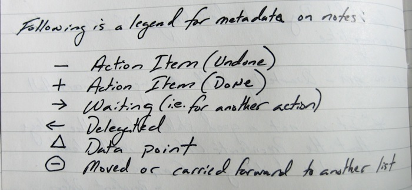

# Dash Plus

* `-` (Dash): Undone Action Item.
* `+` (Plus): Done Action Item.
* `←` (Left Arrow): Delegated (with a note to whom and the date).
* `→` (Right Arrow): Waiting – (i.e. for another action).
* `△` (Triangle): Data Point.
* `◯` (Circle): A circle around any of the above means that it has been carried forward, moved to another list or otherwise changed status – i.e. a “Waiting” item has now become an Action Item elsewhere (with a note about where that item has gone).

Could use Combining Enclosing Circle - http://www.fileformat.info/info/unicode/char/20dd/index.htm

http://patrickrhone.com/2008/05/07/dashplus-in-action/

http://patrickrhone.com/2006/05/12/org-fu-uberpost-productivity-whitepaper/

c.f.  [The Ivy Lee Method](/gtd.md)