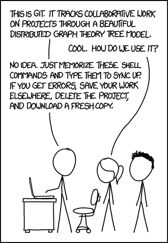

# Git DVCS

**_Do not rebase commits that you have pushed to a public repository._**

Listen to [this](http://mobilecouch.co/95) from MobileCouch.

<ul>
<li><a href="https://github.com" class="link" rel="nofollow" target="_blank">GitHub</a></li>
<li><a href="https://bitbucket.org" class="link" rel="nofollow" target="_blank">Bitbucket</a></li>
<li><a href="https://about.gitlab.com" class="link" rel="nofollow" target="_blank">GitLab</a></li>
<li><a href="https://www.youtube.com/watch?v=X0VH78ye4yY" class="link" rel="nofollow" target="_blank">Big Code: Developer Infrastructure at Facebook's Scale (YouTube)</a></li>
<li><a href="https://www.digitalocean.com/community/tutorials/how-to-set-up-automatic-deployment-with-git-with-a-vps" class="link" rel="nofollow" target="_blank">How To Set Up Automatic Deployment with Git with a VPS (Digital Ocean)</a></li><li><a href="http://danger.systems" class="link" rel="nofollow" target="_blank">Danger CI</a></li><li><a href="https://www.git-tower.com" class="link" rel="nofollow" target="_blank">Tower</a></li><li><a href="https://www.sourcetreeapp.com" class="link" rel="nofollow" target="_blank">SourceTree</a></li><li><a href="http://gitup.co" class="link" rel="nofollow" target="_blank">GitUp</a></li>
</ul>

 * [how-to-find-out-the-most-popular-repositories-on-github](http://stackoverflow.com/questions/19855552)
 * Git [Cheatsheet](https://medium.freecodecamp.com/git-cheat-sheet-and-best-practices-c6ce5321f52#.v01okb91y)



Get workflow for a single developer sorted & documents the small subset of commands I need to learn.

```bash
mkdir ./repositry
cd ./repositry
git init
git config user.name "Rik Watson"
git config user.email "rik@plancd.com"
```

## Ultra Basic Workflow

```bash
git init
git Add -A
git commit -m "Initial commit
git remote add origin get@github.com:rikwatson/repo-name.git
git push -u origin master
# Do some real work.
git add changed.file another_changed.file
git commit -m "suitable comment"
get push -u origin master
```

## Shallow clone

```bash
# To clone repo foo.git with branch bar do:

git clone --depth 1 https://path/to/repo/foo.git -b bar
```

## Passwords

Store passwords in `~/.netrc` e.g.

```
machine github.com
       login rikwatson
       password thisismypassword
```

## Nice log output for HockeyApp etc

```bash
git log --graph --pretty=format:'%h -%d %s <%an>' --abbrev-commit #{ENV['GIT_PREVIOUS_SUCCESSFUL_COMMIT'] || 'HEAD^^^^^'}..HEAD
git log --graph --pretty=format:'%h -%d %s <%an>' --abbrev-commit #{$GIT_PREVIOUS_SUCCESSFUL_COMMIT || 'HEAD^^^^^'}..HEAD
git log --graph --pretty=format:'%h -%d %s <%an>' --abbrev-commit e4a01444630800f7a2f936683805622633a2c206...HEAD
```

`GIT_PREVIOUS_SUCCESSFUL_COMMIT` is set by [Jenkins](/jenkins).

## Jenkins

This is the command from [Jenkins](/jenkins) to update itself.

```
Building on master in workspace /Users/Shared/Jenkins/Home/jobs/Android TEST variant/workspace
 > git rev-parse --is-inside-work-tree # timeout=10
Fetching changes from the remote Git repository
 > git config remote.origin.url https://github.com/myteam/my-native-android # timeout=10
Fetching upstream changes from https://github.com/myteam/my-native-android
 > git --version # timeout=10
using .gitcredentials to set credentials
 > git config --local credential.username email@emaple.com # timeout=10
 > git config --local credential.helper store --file=/Users/Shared/Jenkins/tmp/git8723421402276973754.credentials # timeout=10
 > git -c core.askpass=true fetch --tags --progress https://github.com/myteam/my-native-android +refs/heads/*:refs/remotes/origin/*
 > git config --local --remove-section credential # timeout=10
 > git rev-parse refs/remotes/origin/develop^{commit} # timeout=10
 > git rev-parse refs/remotes/origin/origin/develop^{commit} # timeout=10
Checking out Revision 3c5a8e26146661629d577d2e95eb346e1b473116 (refs/remotes/origin/develop)
 > git config core.sparsecheckout # timeout=10
 > git checkout -f 3c5a8e26146661629d577d2e95eb346e1b473116
 > git rev-list a5cd8ad542ba42f6bc341ecdabc24ed9f4748aa8 # timeout=10
```

Which is odd, I would have expected a simple `git pull` to work.

 * [Git For TFS Users](https://ryoshiga.com/2016/06/01/if-you-are-not-using-git-you-are-missing-out/)

## Getting nice release notes from git in [jenkins](/jenkins)

```bash
git fetch --unshallow
git log --merges  --pretty=format:'%h -%d %s <%an>' --abbrev-commit #{ENV['GIT_PREVIOUS_SUCCESSFUL_COMMIT']}..HEAD | grep " - Merge pull request "
```

## Reading List

 * [`Git From The Bottom Up`](http://ftp.newartisans.com/pub/git.from.bottom.up.pdf) is a great start at understanding
the underlying technology behind Git (SHA-1 add all that).
 * [Git for Humans](https://abookapart.com/products/git-for-humans), A Book Apart.

## GitFlow

`gitflow` is the definitive workflow for `git`. No compelling reason to use anthing else.

Unless [githubflow](http://gitversion.readthedocs.io/en/latest/git-branching-strategies/githubflow/) works for you,
[introduction](https://guides.github.com/introduction/flow/index.html) via GitHub.

## Useful commands

### Fork & keep in sync.

For CI reasons it's useful to have a read-only fork of a repositry which is kept in sync with its master.

## Terminology

[Git Terminology](./git.terminology.md)

## Mirroring a repo 

Not cloning.

 * https://chrisdown.name/2013/07/05/setting-up-local-github-mirror-with-cgit-git-daemon.html
 * http://stackoverflow.com/questions/11370239/creating-an-official-github-mirror
 * http://stackoverflow.com/questions/15871787/automatically-mirroring-a-github-repo
 * https://github.com/beefsack/git-mirror

## Password caching

On MacOS, take a look [here](https://help.github.com/articles/caching-your-github-password-in-git/), basicall `git config --global credential.helper osxkeychain`

----

[Setup github][setup]

I'm [rikwatson on](https://github.com/rikwatson) GitHub & A/C Create on [GitLab](https://gitlab.com/), also `rikwatson`

 * An introdction to Git [Hooks][hooks].
 * [GitHub cheatsheet][cheetsheet]
 * [git-it][learning] is a nice learning module, worth running through.
 * [GitBook][gitbook], publish books using Git and Markdown
 * [Pro Git][progit]
 * [Git tracking relationships][tracking]
 * Git Tower [Learning][learning]

A nice branching method [here](http://nvie.com/posts/a-successful-git-branching-model/)


 * [GitBox](http://blog.oleganza.com/post/13630966174/gitbox-is-1-year-old-status-report)
 * [gist](http://gist.io/3135754).[io](http://gist.io/) **Very cool**
 * http://robots.thoughtbot.com/post/4747482956/streamline-your-git-workflow-with-aliases
 * https://sandofsky.com/blog/git-workflow.html

# Gists

Simple command line access via [gist](https://github.com/defunkt/gist), install via `brew install gist`


Gists [visible](https://dl.dropbox.com/u/2226856/gists/index.html) on wwwroot in Dropbox.
[GistBox][gistbox] looks cook.

You can get the RAW text of a GIST via: https://gist.github.com/rikwatson/3688990/raw/

(Possibly even http).

Look at C:\Dropbox\work\chrome_packaged_apps\_template_\00-build.py & C:\Dropbox\Public\gists

# [Mirroring a repository](https://help.github.com/articles/duplicating-a-repository/)

To make an exact duplicate, you need to perform both a bare-clone and a mirror-push.

Open up the command line, and type these commands:

```
git clone --bare https://github.com/exampleuser/old-repository.git
# Make a bare clone of the repository

cd old-repository.git
git push --mirror https://github.com/exampleuser/new-repository.git
# Mirror-push to the new repository

cd ..
rm -rf old-repository.git
# Remove our temporary local repository
```

If you want to mirror a repository in another location, including getting updates from the original, you can clone a mirror and periodically push the changes.

```
git clone --mirror https://github.com/exampleuser/repository-to-mirror.git
# Make a bare mirrored clone of the repository

cd repository-to-mirror.git
git remote set-url --push origin https://github.com/exampleuser/mirrored
# Set the push location to your mirror
```

As with a bare clone, a mirrored clone includes all remote branches and tags, but all local references will be overwritten each time you fetch, so it will always be the same as the original repository. Setting the URL for pushes simplifies pushing to your mirror. To update your mirror, fetch updates and push, which could be automated by running a cron job.

```
git fetch -p origin
git push --mirror
```

[learning]: https://github.com/jlord/git-it
[gitbook]: https://www.gitbook.io/
[progit]: http://gitbookio.github.io/git/en/
[gistbox]: https://app.gistboxapp.com/library/my-gists
[hooks]: http://www.sitepoint.com/introduction-git-hooks/
[cheetsheet]: https://github.com/tiimgreen/github-cheat-sheet
[setup]: https://help.github.com/articles/set-up-git
[tracking]: http://www.drdobbs.com/architecture-and-design/git-tracking-relationships-use-the-full/240168881
[learning]: http://www.git-tower.com/learn/


----

```
$ mkdir git-cli
$ cd git-cli/
$ ls

$ echo "test" > first.txt

$ ls
first.txt

$ git status
fatal: Not a git repository (or any of the parent directories): .git

$ git init
Initialized empty Git repository in C:/_root/git-cli/.git/

$ git st
On branch master

Initial commit

Untracked files:
  (use "git add <file>..." to include in what will be committed)

        first.txt

nothing added to commit but untracked files present (use "git add" to track)

$ git add first.txt

$ git st
On branch master

Initial commit

Changes to be committed:
  (use "git rm --cached <file>..." to unstage)

        new file:   first.txt


$ echo "asdadasd" > first.txt

$ git status
On branch master

Initial commit

Changes to be committed:
  (use "git rm --cached <file>..." to unstage)

        new file:   first.txt

Changes not staged for commit:
  (use "git add <file>..." to update what will be committed)
  (use "git checkout -- <file>..." to discard changes in working directory)

        modified:   first.txt


$ git diff --staged
diff --git a/first.txt b/first.txt
new file mode 100644
index 0000000..9daeafb
--- /dev/null
+++ b/first.txt
@@ -0,0 +1 @@
+test

$ git diff
diff --git a/first.txt b/first.txt
index 9daeafb..80939b6 100644
--- a/first.txt
+++ b/first.txt
@@ -1 +1 @@
-test
+asdadasd

$ git add .

$ git st
On branch master

Initial commit

Changes to be committed:
  (use "git rm --cached <file>..." to unstage)

        new file:   first.txt


$ git diff --staged
diff --git a/first.txt b/first.txt
new file mode 100644
index 0000000..80939b6
--- /dev/null
+++ b/first.txt
@@ -0,0 +1 @@
+asdadasd

$ git commit -m "Add first.txt"
[master (root-commit) 72da1cf] Add first.txt
 1 file changed, 1 insertion(+)
 create mode 100644 first.txt

$ git st
On branch master
nothing to commit, working tree clean

$ git hist
* 72da1cf 2017-01-20 | Add first.txt (HEAD -> master) [Rob Bell]

$ git st
On branch master
nothing to commit, working tree clean

$ git remote add origin https://github/robbell/git-cli

$ git push -u origin master
fatal: unable to access 'https://github/robbell/git-cli/': Couldn't resolve host 'github'

$ git remote add origin https://github.com/robbell/git-cli
fatal: remote origin already exists.

$ git remote remove origin

$ git remote add origin https://github.com/robbell/git-cli

$ git push -u origin master
Counting objects: 3, done.
Writing objects: 100% (3/3), 220 bytes | 0 bytes/s, done.
Total 3 (delta 0), reused 0 (delta 0)
To https://github.com/robbell/git-cli
 * [new branch]      master -> master
Branch master set up to track remote branch master from origin.

$ echo "second change" > second.txt

$ echo "second change" > first.txt

$ git st
On branch master
Your branch is up-to-date with 'origin/master'.
Changes not staged for commit:
  (use "git add <file>..." to update what will be committed)
  (use "git checkout -- <file>..." to discard changes in working directory)

        modified:   first.txt

Untracked files:
  (use "git add <file>..." to include in what will be committed)

        second.txt

no changes added to commit (use "git add" and/or "git commit -a")

$ git add .

$ git commit -m "Add second.txt"
[master af41b73] Add second.txt
 2 files changed, 2 insertions(+), 1 deletion(-)
 create mode 100644 second.txt

$ git st
On branch master
Your branch is ahead of 'origin/master' by 1 commit.
  (use "git push" to publish your local commits)
nothing to commit, working tree clean

$ git hist
* af41b73 2017-01-20 | Add second.txt (HEAD -> master) [Rob Bell]
* 72da1cf 2017-01-20 | Add first.txt (origin/master) [Rob Bell]

$ git pull
Already up-to-date.

$ git push
Counting objects: 3, done.
Delta compression using up to 4 threads.
Compressing objects: 100% (2/2), done.
Writing objects: 100% (3/3), 264 bytes | 0 bytes/s, done.
Total 3 (delta 0), reused 0 (delta 0)
To https://github.com/robbell/git-cli
   72da1cf..af41b73  master -> master

```