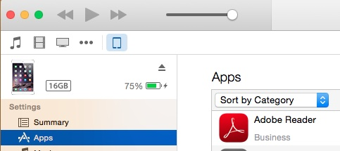
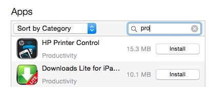
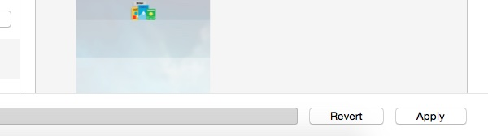
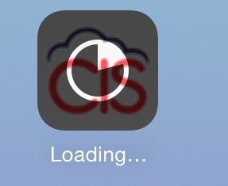

# Installing an iOS application (APK) on iOS

The simplest way to install a developer created application (Actually a `.IPA` file) is via iTunes.

You can install IPA file using iTunes 12.x onto device using below steps :

Drag-and-drop IPA file into 'Apps' tab of iTunes **BEFORE** you connect the device.

 * Connect your device
 * Select your device on iTunes
 * Select 'Apps' tab
 

 * Search `app` that you want to install

 * Click on 'Install' button. This will change to 'Will Install'

 * Click on 'Apply' button on right corner. This will initiate process of app installation. You can see status on top of iTunes as well as app on device.

